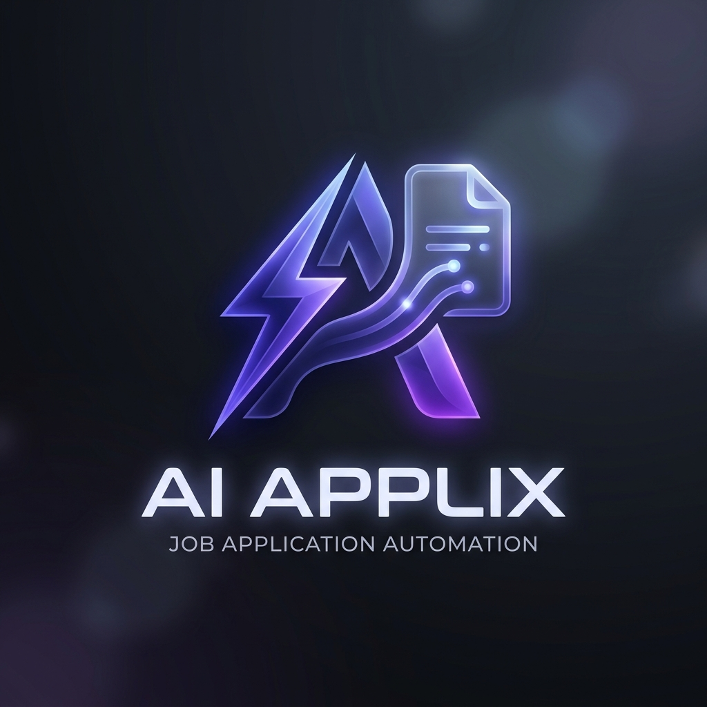

# 🚀 Applyr – Job Application Automation Suite



**Applyr** is a sophisticated, full-stack automation ecosystem designed to eliminate the friction of job hunting. By combining a modern Next.js dashboard with an intelligent Chrome extension, it handles everything from job discovery and matching to autonomous form completion and real-time status tracking.

---

## ✨ Key Features

### 🧠 AI-Driven Personalization
- **Resume Optimizer**: Automatically re-writes your experience bullets and summaries using LLMs (Llama 3.1) to perfectly align with specific job descriptions.
- **Cover Letter Architect**: Generates professional, tailored cover letters in seconds, capturing your unique voice and the company's requirements.
- **Dynamic PDF Generation**: Integrated `jsPDF` engine creates and downloads your optimized resumes on the fly.

### 🤖 Intelligent Multi-Step Auto-Apply
- **Autonomous Form Filling**: Navigates complex, multi-page application portals (LinkedIn, Indeed) with ease.
- **AI Question Answering**: Dynamically generates accurate responses for non-standard qualitative questions based on your professional profile.
- **Field Detection Engine**: Advanced heuristics to identify and map even the most obscure form fields.

### 🛡️ Human-Centric Safety & Anti-Detection
- **Behavior Simulation**: Randomized delays and natural typing patterns to bypass advanced bot-detection algorithms.
- **Application Throttling**: Built-in daily limits to maintain a safe, human-like application pace.
- **Local-First Privacy**: Sensitive data stays in your browser's local storage—no external server dependencies for your profile data.

### 📊 Centralized Command Center
- **Next.js Dashboard**: A premium glassmorphism interface to manage your profile, skills, and Q&A bank.
- **Real-Time Status Tracking**: Background scraping engine automatically monitors your applications (Applied, Viewed, Rejected) and syncs them to your dashboard.

---

## 🏗️ Architecture

The project is split into two primary components:

1.  **Dashboard (`/dashboard`)**: A Next.js web application for profile management and automation control.
2.  **Extension (`/extension`)**: A Manifest V3 Chrome extension that handles all browser-level automation and scraping.

---

## 🚀 Getting Started

### Prerequisites
- Node.js (v18+)
- Google Chrome Browser

### 1. Dashboard Setup
```bash
cd dashboard
npm install
npm run dev
```
Open [http://localhost:3000](http://localhost:3000) to access your command center.

### 2. Extension Installation
1.  Open Chrome and navigate to `chrome://extensions/`.
2.  Enable **Developer mode** (top right).
3.  Click **Load unpacked**.
4.  Select the `extension` folder from this repository.

### 3. AI Configuration
1.  Open the Extension Popup or Dashboard Settings.
2.  Enter your **OpenRouter API Key** to enable Llama 3.1 powered features.

---

## 🛠️ Technical Stack

- **Frontend**: Next.js 15, React 19, TailwindCSS 4
- **Extension**: Manifest V3, Service Workers, Content Scripts
- **AI**: OpenRouter API (Llama 3.1 / meta-llama/llama-3.1-8b-instruct)
- **PDF/Docs**: jsPDF, pdf-parse
- **State Management**: Chrome Storage API (local)

---

## 📝 Disclaimer

*This tool is intended to assist with the job application process. Users should always review AI-generated content and ensure compliance with the terms of service of the platforms they are applying to.*

---

<p align="center">
  Built with ❤️ for the modern job seeker.
</p>
